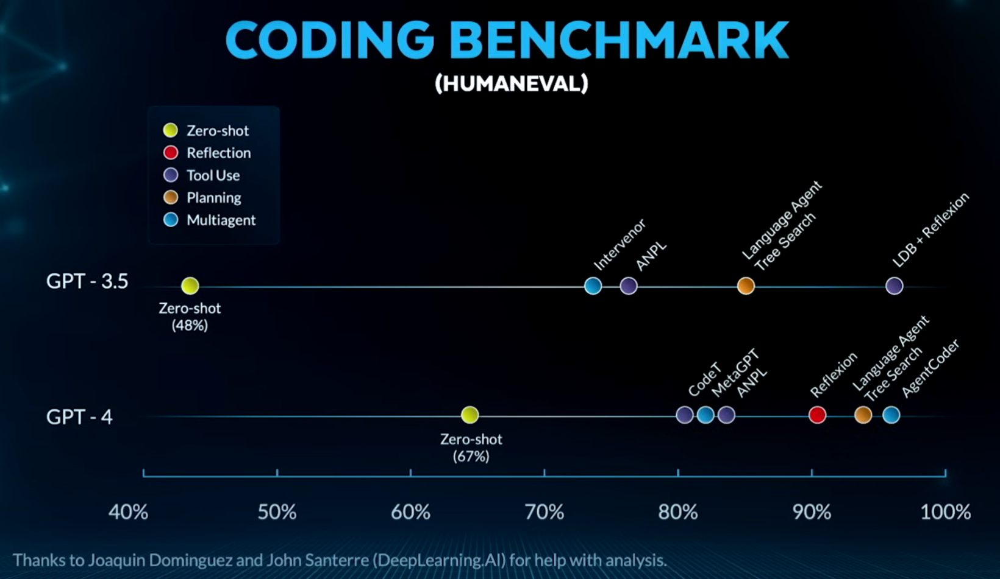
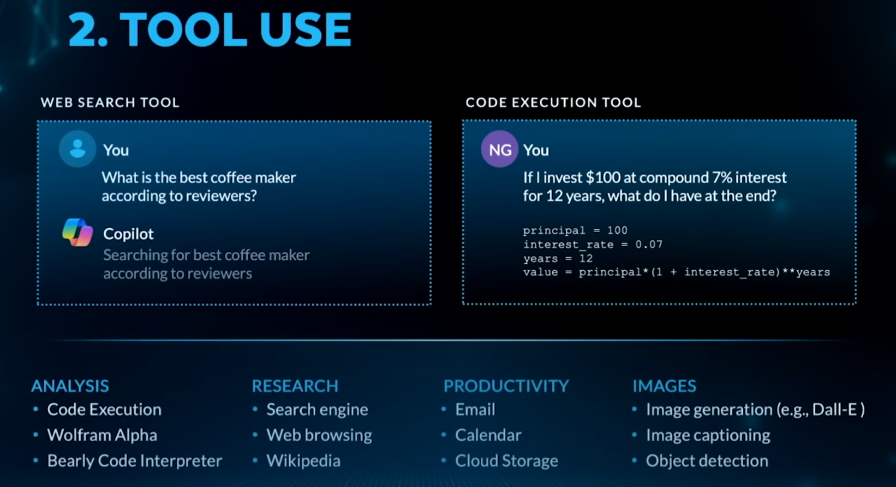

# What is AI agent?
"If you were to ask what is the one most important AI technology to pay attention to, I would say it's agentic AI," said Andrew Ng in early 2024.

[Andrew Ng Explores The Rise Of AI Agents And Agentic Reasoning | BUILD 2024 Keynote - YouTube](https://www.youtube.com/watch?v=KrRD7r7y7NY)

## 1. Agentic Workflow

Agentic workflow is a circular and iterative process

 

agentic workflow scores higher in coding benchmark

## 2. Agentic Design Pattern

### 2.1 Reflection

Done by human-AI interaction

 

Done by AI-AI interaction

### 2.2 Tool Use

#### 1. The System Prompt: The Rulebook

Before the conversation even starts, the LLM is given a **system prompt** that defines its capabilities and rules. This prompt is crucial and includes:
*   **Role Definition:** "You are a helpful assistant that has access to the following tools:"
*   **Tool Definitions:** A detailed description of each available tool, its purpose, and its required parameters (in a structured format like JSON Schema).
*   **Instructions on How to Respond:** The prompt strictly dictates the format the LLM must use to request a tool. For example:
    *   "If you need to use a tool, generate a response in this exact format:"
    *   `{"name": "calculator", "arguments": {"expression": "5 + 3"}}`
*   **Instructions on What NOT to Do:** "DO NOT make up the result of a tool. You MUST use the tool if you need information."

This system prompt sets the stage for all subsequent reasoning.

#### 2. The Loop: Reason, Act, Observe

The process then enters a loop for each user message:

**a) Reason (LLM Thinks):**
The LLM receives the user's query and the system prompt. It analyzes the query and decides: "Can I answer this with my internal knowledge, or do I need a tool?"
*   *Example:* User asks: "What is 37593 * 28383?"
*   *Reasoning:* "I'm an LLM. I'm bad at large number arithmetic. I should use the calculator tool. The system prompt tells me to use the JSON format."

**b) Act (LLM Requests the Tool):**
The LLM doesn't output text for the user. Instead, it follows the system prompt's rules and generates the precise structured command (e.g., a JSON blob) to call the tool.
*   *Action:* It outputs: `{"name": "calculator", "arguments": {"expression": "37593 * 28383"}}`

**c) Observe (The Framework Runs the Tool):**
The agent framework (e.g., LangChain, LlamaIndex, OpenAI's own framework) surrounding the LLM:
1.  **Parses** the LLM's JSON output.
2.  **Executes** the corresponding function in the backend code.
3.  **Gets the result** from the function (e.g., `1067265519`).
4.  **Feeds the result back** to the LLM as a new piece of information, often labeled as an "Observation."

**d) Repeat or Respond:**
The LLM now has the result of the tool. It looks at the original question and the new observation and decides: "Is this enough to answer the user, or do I need to use another tool?"
*   In this case, it has the answer. It breaks out of the loop and formulates a final, natural language response for the user: "37593 multiplied by 28383 equals 1,067,265,519."

This loop can happen multiple times for a single query. For a complex question like "What's the current price of the most expensive stock in the NASDAQ 100?", the LLM might:
1.  Use a `search_nasdaq_100_list` tool to get the list.
2.  Reason about which stock is most expensive (maybe using a `sort` tool or its own knowledge).
3.  Use a `get_stock_price` tool for that specific company.
4.  Then respond.

Note:

If the LLM "Breaks the Rules" of API calling, the framework will catch the parse error. It now calls the LLM again, but this time it appends a new message to the history, for example:

`[System] Error: Your last response was not valid JSON. You must output ONLY the JSON object with no other text. Please reformat your tool call.`

And, Yes, the agent framework checks every single output from the LLM. It uses a dedicated parser that performs pattern matching and validation against a pre-defined schema (e.g., "Is this valid JSON for a tool call?").

This check is the fundamental gatekeeper that decides whether the loop continues with a tool execution or ends with a final answer to the user. The robustness of this parser and the error handling around it are what separate a simple prototype from a production-ready AI agent.

---

### 2.3 Planning/Reasoning

### 2.4 Multiagent Collaboration

5-10 tools are recommended

Mutil Agent Frameworks:

Langchain, Langgraph, CrewAI, AutoGen, Swarm, Agno, N8N, make.com (Google ADK / OpenAI ADK)?

## 3. LMM-Based Agents

## 4. AI Stack

## 5. AI Trends / Conclusion

